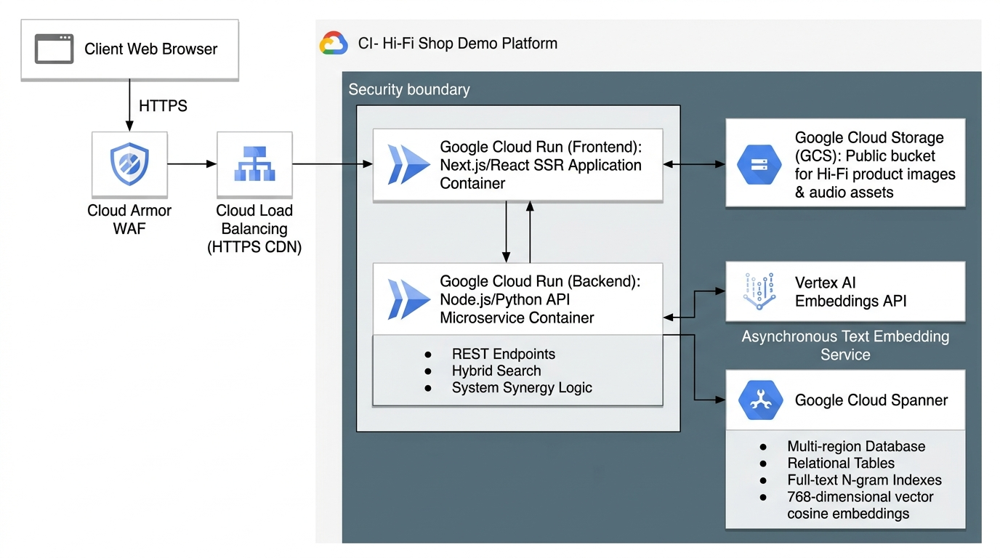

# Hi-Fi Equipment E-Commerce Demo Platform
> **Inspired by Aria Audio (雅詠音響)** | High-Performance Audiophile Retail & Acoustic Hybrid Search

[](https://cloud.google.com)
[](LICENSE)
[](#localization--dual-language-support)

---

## 📌 Executive Summary

The **Hi-Fi Equipment E-Commerce Demo Platform** is a flagship digital e-commerce application designed specifically for high-end luxury audiophile hardware—such as Digital-to-Analog Converters (DACs), Vacuum Tube Amplifiers, High-Resolution Network Streamers, Turntables, Headphones/IEMs, Loudspeakers, Cables, and Power Conditioners.

Unlike generic retail platforms, purchasing audiophile equipment requires matching rigid hardware parameters (*Balanced XLR, I2S HDMI/RJ45, AES/EBU, Impedance $\Omega$*) with subjective acoustic sound signatures (*"warm tube soundstage"*, *"analytical sound with tight bass response"*, *"smooth vocal presence"*).

This platform demonstrates a **Hybrid Search Engine** built on **Google Cloud Spanner**, seamlessly fusing traditional **BM25 N-gram Full-Text Keyword Search** with **768-dimensional Vector Cosine Similarity Search** (via Vertex AI Text Embeddings) using Reciprocal Rank Fusion (RRF).

---

## ✨ Key Features

- 🔍 **Hybrid Acoustic & Technical Search**: Search by exact SKU, technical interface specs, or natural language sound characteristics (e.g. *"溫暖人聲 解碼器 3萬以下"* / *"Warm tube sound DAC under $30,000 HKD"*).
- 🌐 **Hong Kong Localization (`zh-HK` & `en-US`)**: Dual-language UI switching honoring authentic Hong Kong audiophile terminology (解碼器, 擴音機, 膽機, 網絡播放器, 黑膠唱機, 入耳式耳機, 線材).
- 💲 **Strict Single-Currency Rule (HKD)**: Operates exclusively in Hong Kong Dollars (`HKD $`). Toggling the UI language to English translates text while preserving prices strictly in HKD without conversion.
- 🛍️ **Guest Shopping Mode**: Seamless catalog browsing, hybrid search, hardware spec filtering, and shopping cart management without requiring user login or account registration.
- ⚡ **Electrical Component Synergy Engine**: Real-time electrical compatibility checks between amplifiers (output impedance/power) and headphones/speakers (impedance/sensitivity) to warn against gain staging mismatches.

---

## 🏗️ Google Cloud Solution Architecture

The application is architected around the **Google Cloud Well-Architected Framework (WAF)**:



### Architecture Highlights
* **Compute Layer**: Stateless Next.js (React SSR) Frontend & Node.js/Python REST API microservices deployed on **Google Cloud Run** with scale-to-zero serverless execution.
* **Database & Vector Search**: **Google Cloud Spanner** providing 99.999% multi-region availability, hosting relational schema, BM25 N-gram full-text index, and 768-dim vector cosine KNN index in a single unified storage tier.
* **AI Embeddings**: **Vertex AI Text Embeddings API** (`text-embedding-004`) generating dense vector embeddings asynchronously.
* **Asset Storage & CDN**: Lossless product images and static assets served from **Google Cloud Storage (GCS)** public buckets cached globally via **Google Cloud CDN**.
* **Perimeter Security**: Public endpoints protected by **Google Cloud Armor WAF** with DDoS mitigation, CORS, and TLS 1.3 encryption.

---

## 📁 Documentation Index

Detailed project requirements and architecture decision records are available in the [`docs/`](docs/) directory:

- 📋 [**Business Requirements Document (BRD)**](docs/hifi_shop_business_requirements.md) — Comprehensive executive summary, user personas, HK Hi-Fi domain glossary, 32 seed product taxonomy, and Given/When/Then acceptance criteria.
- 📐 [**Solution Architecture Overview**](docs/hifi_shop_solution_architecture.md) — Full GCP architectural specification, 5 WAF pillars, 2-column ADR tables (ADR-001 to ADR-004), Mermaid component topology, sequence diagrams, and NFR latency SLAs.

---

## 📂 Project Repository Structure

```
hifi-shop-demo/
├── docs/
│   ├── assets/
│   │   └── hifi_architecture_diagram.jpg   # GCP System Architecture Diagram
│   ├── hifi_shop_business_requirements.md  # Business Requirements Document (BRD)
│   └── hifi_shop_solution_architecture.md # Solution Architecture Overview & ADRs
├── .gitignore                             # Git ignore rules
└── README.md                              # Project documentation entry point
```

---

## 📜 License

This demo project is released under the [MIT License](LICENSE). Inspired by [Aria Audio (雅詠音響)](https://aria-audio.com).
