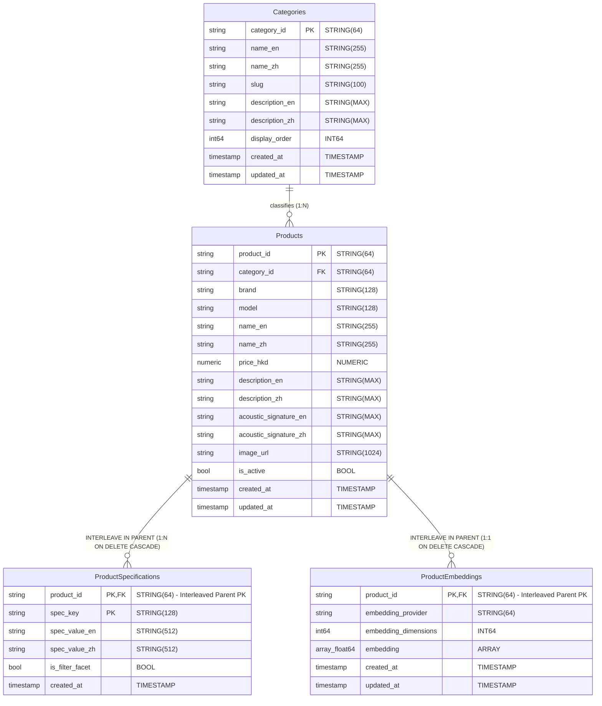

# Database Schema Design Document
## Hi-Fi Shop Demo Platform (Inspired by Pro Audio 雅詠音響)

| Document Attribute | Specification Details |
| :--- | :--- |
| **Document Title** | Database Schema Design Specification – Hi-Fi Shop Demo Platform |
| **Target File Path** | `docs/hifi_shop_database_schema.md` |
| **Author** | Lead Database Architect |
| **Target Audience** | Data Engineers, Solution Architects, Backend Engineers, DBA Team |
| **Target Storage Engine**| Google Cloud Spanner (GoogleSQL Dialect) |
| **Version** | 1.1.0 |
| **Status** | Approved DDL Specification |
| **Last Updated** | August 13, 2026 |

---

## Executive Summary & Database Architecture Context

The **Hi-Fi Shop Demo Platform** database schema is engineered specifically for **Google Cloud Spanner**, a globally distributed, multi-region operational database offering 99.999% availability, strict ACID transactional consistency, and horizontal scalability. 

Audiophile retail platforms present unique database architectural challenges:
1. **Multi-Faceted Hardware Specifications**: Products possess distinct technical electrical and physical interface parameters (e.g. *Balanced XLR, I2S HDMI/RJ45, AES/EBU, Tube complements, Impedance matching*).
2. **Subjective Acoustic Search Requirements**: Customers search using natural language sound signature descriptions (e.g. *"warm analog soundstage"*, *"analytical sound with tight bass"*), requiring dense vector semantic search alongside exact SKU/brand keyword search.
3. **Guest Session & Localization Consistency**: The platform operates in **Guest Shopping Mode** by default, enforcing strict **Single-Currency HKD pricing ($HKD)** while supporting dual-language catalog metadata (**English `en-US` and Traditional Chinese `zh-HK`**).

To satisfy these requirements without data synchronization drift or distributed infrastructure overhead, Cloud Spanner serves as a **Unified Data Engine** handling relational tables, BM25 N-gram full-text search indexes, and 768-dimensional vector cosine distance search within a single physical cluster.

---

## 1. Entity-Relationship (ER) Diagram

The following Mermaid JS ER Diagram illustrates the relational topology, primary key relationships, and parent-child interleaving structures across the database schema:



---

## 2. Detailed Data Dictionary

### 2.1 Table: `Categories`
Top-level entity storing product taxonomy and dual-language category metadata.

| Column Name | Data Type | Nullable | Constraints & Defaults | Description |
| :--- | :--- | :---: | :--- | :--- |
| `category_id` | `STRING(64)` | **No** | `PRIMARY KEY` | Unique category identifier (e.g. `dacs`, `amplifiers`). |
| `name_en` | `STRING(255)` | **No** | | English category title (e.g. *"DACs (Digital-to-Analog Converters)"*). |
| `name_zh` | `STRING(255)` | **No** | | Traditional Chinese category title (e.g. *"解碼器 (DACs)"*). |
| `slug` | `STRING(100)` | **No** | `UNIQUE` | URL-friendly slug identifier for storefront routing. |
| `description_en`| `STRING(MAX)` | Yes | | English taxonomy description. |
| `description_zh`| `STRING(MAX)` | Yes | | Traditional Chinese taxonomy description. |
| `display_order` | `INT64` | **No** | | Integer order weight for navigation rendering. |
| `created_at` | `TIMESTAMP` | **No** | `allow_commit_timestamp=true` | System creation timestamp. |
| `updated_at` | `TIMESTAMP` | **No** | `allow_commit_timestamp=true` | System modification timestamp. |

---

### 2.2 Table: `Products`
Master table containing core audiophile product records, HKD catalog pricing, localized metadata, and acoustic signatures.

| Column Name | Data Type | Nullable | Constraints & Defaults | Description |
| :--- | :--- | :---: | :--- | :--- |
| `product_id` | `STRING(64)` | **No** | `PRIMARY KEY` | Unique product identifier (e.g. `prod-chord-hugo-tt2`). |
| `category_id` | `STRING(64)` | **No** | `FK -> Categories.category_id` | Foreign key referencing category taxonomy. |
| `brand` | `STRING(128)` | **No** | | Manufacturer brand name (e.g. *"Chord Electronics"*, *"McIntosh"*). |
| `model` | `STRING(128)` | **No** | | Hardware model designation (e.g. *"Hugo TT 2"*, *"MA8950"*). |
| `name_en` | `STRING(255)` | **No** | | Full product title in English `en-US`. |
| `name_zh` | `STRING(255)` | **No** | | Full product title in Traditional Chinese `zh-HK`. |
| `price_hkd` | `NUMERIC` | **No** | | Fixed-precision catalog price strictly in Hong Kong Dollars (HKD). |
| `description_en`| `STRING(MAX)` | Yes | | Comprehensive marketing description in English. |
| `description_zh`| `STRING(MAX)` | Yes | | Comprehensive marketing description in Traditional Chinese. |
| `acoustic_signature_en` | `STRING(MAX)` | Yes | | English summary of subjective acoustic characteristics. |
| `acoustic_signature_zh` | `STRING(MAX)` | Yes | | Traditional Chinese summary of subjective acoustic characteristics. |
| `image_url` | `STRING(1024)`| Yes | | Lossless GCS/CDN product image URL. |
| `is_active` | `BOOL` | **No** | `DEFAULT (true)` | Product availability flag for search and catalog queries. |
| `search_tokens` | `TOKENLIST` | **No** | `HIDDEN, AS (TOKENLIST_CONCAT(...))` | Generated TokenList column aggregating full-text search tokens. |
| `created_at` | `TIMESTAMP` | **No** | `allow_commit_timestamp=true` | Record creation timestamp. |
| `updated_at` | `TIMESTAMP` | **No** | `allow_commit_timestamp=true` | Record update timestamp. |

---

### 2.3 Table: `ProductSpecifications` (Interleaved Child)
Interleaved table storing structured physical interface parameters, electrical specifications, tube types, and impedance ratings.

| Column Name | Data Type | Nullable | Constraints & Defaults | Description |
| :--- | :--- | :---: | :--- | :--- |
| `product_id` | `STRING(64)` | **No** | `PK (Part 1), Interleaved Parent` | Parent product identifier. |
| `spec_key` | `STRING(128)` | **No** | `PK (Part 2)` | Specification key (e.g. `dac_chip`, `input_interface`, `impedance_ohms`). |
| `spec_value_en` | `STRING(512)` | **No** | | Localized specification value in English (e.g. *"XLR Balanced, RCA"*). |
| `spec_value_zh` | `STRING(512)` | **No** | | Localized specification value in Traditional Chinese. |
| `is_filter_facet`| `BOOL` | **No** | `DEFAULT (false)` | Flag indicating if spec key is exposed as a UI filter facet. |
| `created_at` | `TIMESTAMP` | **No** | `allow_commit_timestamp=true` | Spec creation timestamp. |

> **Interleaving Constraint**: `INTERLEAVE IN PARENT Products ON DELETE CASCADE`

---

### 2.4 Table: `ProductEmbeddings` (Interleaved Child)
Interleaved table storing high-dimensional semantic vector embeddings generated by Vertex AI.

| Column Name | Data Type | Nullable | Constraints & Defaults | Description |
| :--- | :--- | :---: | :--- | :--- |
| `product_id` | `STRING(64)` | **No** | `PK, Interleaved Parent` | Parent product identifier. |
| `embedding_provider` | `STRING(64)` | **No** | | AI embedding model identifier (e.g. `vertex-ai-text-embedding-004`). |
| `embedding_dimensions` | `INT64` | **No** | | Dimension count of dense float array (strictly `768`). |
| `embedding` | `ARRAY<FLOAT64>`| **No** | | 768-element floating point array representing acoustic signature. |
| `created_at` | `TIMESTAMP` | **No** | `allow_commit_timestamp=true` | Vector creation timestamp. |
| `updated_at` | `TIMESTAMP` | **No** | `allow_commit_timestamp=true` | Vector update timestamp. |

> **Interleaving Constraint**: `INTERLEAVE IN PARENT Products ON DELETE CASCADE`

---

## 3. Cloud Spanner Interleaving Strategy

Cloud Spanner partitions data horizontally into **splits** based on primary key ranges. In traditional un-interleaved relational databases, querying parent and child tables (such as `Products` and `ProductSpecifications`) requires distributed cross-node network joins, introducing latency overhead.

```
Un-Interleaved Layout (Cross-Node Latency):
[Node A: Products Split] <--- Network Hop ---> [Node B: ProductSpecifications Split]

Interleaved Layout (Colocated Storage Split):
+-------------------------------------------------------------------+
| Spanner Storage Split (Key Range: prod-chord-hugo-tt2)            |
|  - Products Row (prod-chord-hugo-tt2)                             |
|    |- ProductSpecifications Row (prod-chord-hugo-tt2, dac_chip)   |
|    |- ProductSpecifications Row (prod-chord-hugo-tt2, input_if)   |
|    |- ProductEmbeddings Row (prod-chord-hugo-tt2)                 |
+-------------------------------------------------------------------+
```

### 3.1 Primary Key Prefix Compliance
To configure interleaving, child tables define a composite primary key whose leading column strictly matches the parent table's primary key (`product_id`):
- Parent `Products`: `PRIMARY KEY (product_id)`
- Child `ProductSpecifications`: `PRIMARY KEY (product_id, spec_key)`
- Child `ProductEmbeddings`: `PRIMARY KEY (product_id)`

### 3.2 Key Architecture Advantages
1. **Zero-Network-Hop Joins**: Parent product records and all child specs/embeddings physically reside in contiguous memory/disk locations on the exact same Spanner storage split. Joins execute locally in under $\le 5\text{ms}$.
2. **Atomic Single-Split Transactions**: Updating a product along with its hardware specs and vector embeddings executes as a single-split transaction, avoiding expensive two-phase commit (2PC) protocols across multiple database nodes.
3. **Cascading Deletions (`ON DELETE CASCADE`)**: Deleting a product automatically cleans up all associated hardware specifications and 768-dim embeddings in a single atomic split operation without distributed table locks.

---

## 4. BM25 N-Gram Full-Text Search Indexing Specification

To handle exact model numbers (e.g. *"HD800S"*, *"D90 III"*) and localized brand names in dual-language environments (`en-US` and `zh-HK`), Cloud Spanner native `SEARCH INDEX` functionality is configured.

```sql
-- Generated TokenList column on Products table:
-- search_tokens TOKENLIST AS (TOKENLIST_CONCAT([
--   TOKENIZE_FULLTEXT(name_en),
--   TOKENIZE_FULLTEXT(brand),
--   TOKENIZE_FULLTEXT(model),
--   TOKENIZE_FULLTEXT(category_id),
--   TOKENIZE_FULLTEXT(description_en)
-- ])) HIDDEN

-- Full-Text Search Index on Products table:
CREATE SEARCH INDEX idx_products_search ON Products (
  search_tokens
);
```

### 4.1 Tokenization Strategy
- **English Fields (`en-US`)**: Standard `TOKENIZE_FULLTEXT` breaks text into normalized lowercase word tokens, applying stemming and whitespace splitting.
- **Traditional Chinese Fields (`zh-HK`)**: Chinese text lacks whitespace word delimiters. `TOKENIZE_NGRAMS(ngram_size_min=>1, ngram_size_max=>3)` generates unigrams, bigrams, and trigrams (e.g., *"溫暖人聲"* generates `溫`, `暖`, `溫暖`, `暖人`, `人聲`, `溫暖人`). This ensures high recall when HK users query with partial terms like *"膽機"* or *"解碼"*.

### 4.2 Covered Index Storing Strategy
The `STORING` clause includes `category_id`, `price_hkd`, `image_url`, and `is_active`. This allows backend search queries to return complete search results directly from the index without executing a secondary lookup back to the base `Products` table.

---

## 5. 768-Dimensional Vector Cosine Distance Indexing Specification

Subjective acoustic queries (e.g. *"sweet female vocal with smooth tube warmth"*) cannot be resolved by exact keyword matching. The platform utilizes **Vertex AI `text-embedding-004`** to generate 768-dimensional dense floating-point vector representations stored in `ProductEmbeddings.embedding`.

```sql
CREATE VECTOR INDEX idx_product_embeddings_cosine ON ProductEmbeddings (
  embedding OPTIONS (distance_type = 'COSINE')
) STORING (
  embedding_provider,
  embedding_dimensions,
  updated_at
);
```

### 5.1 Distance Function Mechanics
Vector similarity is computed in Cloud Spanner using the `COSINE_DISTANCE` scalar function:
$$\text{CosineDistance}(\vec{u}, \vec{v}) = 1 - \frac{\vec{u} \cdot \vec{v}}{\|\vec{u}\| \|\vec{v}\|}$$
Values range from `0.0` (identical orientation / perfect acoustic match) to `2.0` (opposite orientation).

### 5.2 Hybrid Reciprocal Rank Fusion (RRF) SQL Query Pattern
Backend search API executes parallel scoring using Reciprocal Rank Fusion (RRF) to merge keyword relevance and vector similarity:

```sql
WITH bm25_results AS (
  SELECT product_id
  FROM Products@{FORCE_INDEX=idx_products_search}
  WHERE SEARCH(search_tokens, @query_text) 
    AND is_active = true
    AND LOWER(category_id) = LOWER(@category) -- Optional pushed filter predicate
    AND price_hkd >= @min_price               -- Optional pushed filter predicate
    AND price_hkd <= @max_price               -- Optional pushed filter predicate
    AND LOWER(brand) LIKE @brand_pattern       -- Optional pushed filter predicate
  LIMIT 50
),
vector_results AS (
  SELECT e.product_id, COSINE_DISTANCE(e.embedding, @query_embedding) AS distance
  FROM ProductEmbeddings e
  JOIN Products p ON e.product_id = p.product_id
  WHERE p.is_active = true
    AND COSINE_DISTANCE(e.embedding, @query_embedding) <= 0.65 -- Relevance threshold cutoff
    AND LOWER(p.category_id) = LOWER(@category)               -- Optional pushed filter predicate
    AND p.price_hkd >= @min_price                              -- Optional pushed filter predicate
    AND p.price_hkd <= @max_price                              -- Optional pushed filter predicate
    AND LOWER(p.brand) LIKE @brand_pattern                      -- Optional pushed filter predicate
  ORDER BY distance ASC
  LIMIT 50
),
candidates AS (
  SELECT product_id FROM bm25_results
  UNION DISTINCT
  SELECT product_id FROM vector_results
)
SELECT p.product_id, p.category_id, p.brand, p.model, p.name_en, p.name_zh,
       CAST(p.price_hkd AS FLOAT64) AS price_hkd, p.description_en, p.description_zh,
       p.acoustic_signature_en, p.acoustic_signature_zh, p.image_url, p.is_active
FROM candidates c
JOIN Products p ON c.product_id = p.product_id
WHERE p.is_active = true;
```

---

## 6. Query Performance Guidelines & Optimization Strategies

To consistently achieve sub-150ms p95 latency under high concurrency, query execution plans must be strictly optimized.

### 6.1 Index Hints & Query Plan Tuning
- **Explicit Index Selection**: Force Spanner query optimizer to use covering search indexes rather than full table scans via explicit hints (`@{FORCE_INDEX=idx_products_category_price}`).
- **Eliminating Back-Joins**: Always select columns included in the `STORING` clause of secondary or search indexes.

### 6.2 Stale Reads for Read-Only Replica Scaling
For storefront browsing and catalog listing queries where instantaneous sub-second write visibility is not required, use **Stale Reads** (`EXACT_STALENESS = 15s`). This allows Cloud Spanner read replicas to serve requests locally without acquiring read locks or communicating with the lead leader region, reducing latency to $< 20\text{ms}$.

### 6.3 Batching Interleaved Child Fetching
When retrieving a product with its full specs, rely on Spanner's automatic interleaved child join optimization:
```sql
SELECT 
  p.product_id, p.name_en, p.price_hkd,
  ARRAY(
    SELECT AS STRUCT spec_key, spec_value_en, spec_value_zh 
    FROM ProductSpecifications s 
    WHERE s.product_id = p.product_id
  ) AS specifications
FROM Products p
WHERE p.product_id = @product_id;
```
Because `ProductSpecifications` is interleaved in `Products`, this query executes as a single-split localized scan without incurring secondary query latency.

---

## 7. Migration & Deployment Plan

The SQL deliverables must be executed sequentially in Cloud Spanner using standard DDL/DML migration pipelines:

```
[ Step 1: Create Tables ]  --->  [ Step 2: Create Indexes ]  --->  [ Step 3: Populate Seed Data ]
   sql/01_create_tables.sql         sql/02_create_indexes.sql         sql/03_seed_data.sql
```

1. **`sql/01_create_tables.sql`**: Provisions `Categories`, `Products`, `ProductSpecifications`, and `ProductEmbeddings`.
2. **`sql/02_create_indexes.sql`**: Creates secondary composite indexes, BM25 N-gram search index, and 768-dim vector cosine index.
3. **`sql/03_seed_data.sql`**: Inserts 8 core categories, 32 flagship Hi-Fi seed products, 150+ hardware specifications, and 32 pre-computed 768-dim vector embeddings.

---

## 6.4 Numeric Data Type Projection & Node.js Serialization Strategy

### Rationale & Problem Statement
Cloud Spanner stores `price_hkd` as a fixed-precision `NUMERIC` data type to guarantee exact monetary precision without floating-point rounding errors. However, the `@google-cloud/spanner` Node.js client library returns `NUMERIC` columns as custom `SpannerNumeric` objects (`{ value: "39800.00" }`). When serializing responses with `row.toJSON()`, default JSON stringification converts numeric objects to `null` or unparsed strings, resulting in `$0` or `NaN` price displays in client web applications.

### Solution Standard
All SQL queries in backend services (`catalogService.ts` and `searchService.ts`) MUST project pricing columns using `CAST(price_hkd AS FLOAT64) AS price_hkd`:

```sql
SELECT product_id, category_id, brand, model, name_en, name_zh,
       CAST(price_hkd AS FLOAT64) AS price_hkd,
       description_en, description_zh, acoustic_signature_en, acoustic_signature_zh,
       image_url, is_active
FROM Products
WHERE is_active = true
ORDER BY price_hkd ASC;
```

This forces Cloud Spanner's query engine to convert fixed-precision numerics into standard IEEE 754 64-bit floating-point numbers directly at the database level, ensuring seamless JSON serialization and instant numeric evaluation in microservices.
