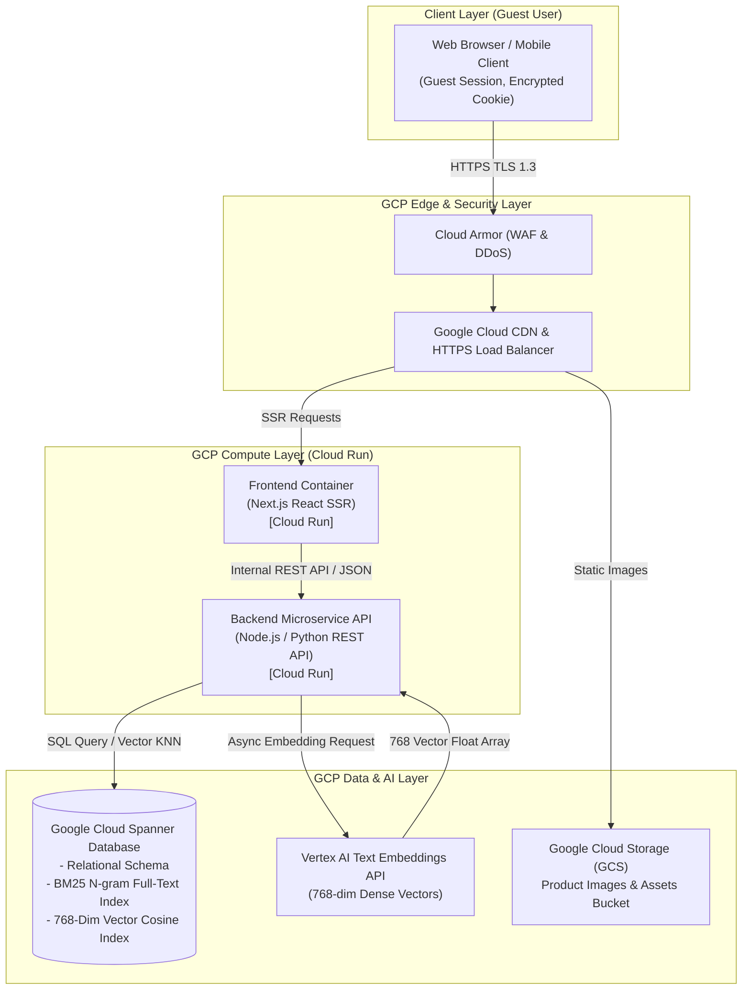
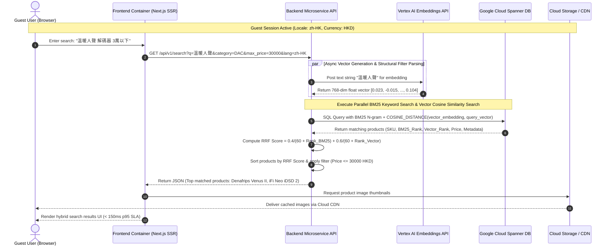
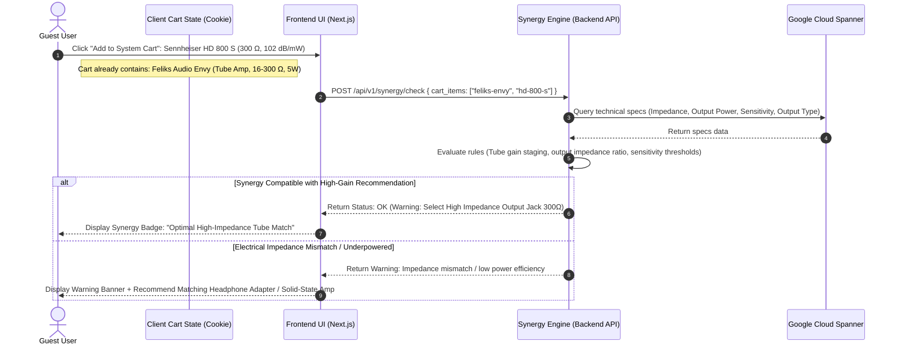

# Solution Architecture Overview
## Hi-Fi Shop Demo Platform (Inspired by Pro Audio 雅詠音響)

| Attribute | Specification |
| :--- | :--- |
| **Document Title** | Solution Architecture Overview – Premium Hi-Fi E-Commerce Demo Platform |
| **Target Path** | `docs/hifi_shop_solution_architecture.md` |
| **Author** | Principal Solution Architect |
| **Status** | Approved Specification |
| **Version** | 2.1.0 |
| **Date** | August 13, 2026 |

---

## Executive Summary & System Overview

The **Hi-Fi Shop Demo Platform** is an enterprise-grade digital demonstration e-commerce application engineered specifically for high-end luxury audiophile equipment (inspired by **Pro Audio 雅詠音響**). Audiophile purchasing decisions diverge significantly from conventional retail; customers evaluate products based on complex physical interface compatibility (e.g., *Balanced XLR, I2S HDMI/RJ45, AES/EBU, RCA, Impedance matching*) and subjective acoustic sound signatures (e.g., *"warm tube soundstage"*, *"analytical sound with tight bass response"*, *"smooth vocals"*).

To address these domain-specific challenges, the platform implements a **Hybrid Search Engine Architecture** powered by **Google Cloud Spanner**, seamlessly fusing traditional **BM25 N-gram Full-Text Keyword Search** with **768-dimensional Vector Cosine Similarity Search** (via Vertex AI Text Embeddings).

The system operates in **Guest Shopping Mode** by default, allowing users to browse the catalog, perform acoustic/spec hybrid queries, verify component synergy, and manage shopping carts without user login or authentication requirements. The platform strictly enforces a **Single-Currency Rule (Hong Kong Dollars - HKD)** while offering seamless **Dual-Language UI switching (`en-US` and `zh-HK`)**.

---

## 1. Google Cloud Well-Architected Framework (WAF) Alignment

The architecture of the Hi-Fi Shop Demo Platform is systematically structured around the five core pillars of the **Google Cloud Well-Architected Framework (WAF)** to ensure operational excellence, security, resilience, performance, and fiscal efficiency.

### 1.1 Operational Excellence
- **Infrastructure as Code (IaC)**: All GCP resources (Cloud Run, Cloud Spanner, Cloud Storage buckets, Cloud Armor security policies, and Load Balancers) are declaratively provisioned and version-controlled via Terraform.
- **Automated CI/CD Pipelines**: Automated container builds (via Cloud Build / GitHub Actions) enforce linting, unit testing, vector query validation, and blue/green deployments to Cloud Run with automatic rollback capabilities.
- **Comprehensive Observability**: Microservices integrate with Google Cloud Observability (Cloud Logging, Cloud Monitoring, Cloud Trace, and Error Reporting). Telemetry includes p95/p99 query latency tracing, hybrid RRF score distributions, and real-time container metrics.
- **Zero-Downtime Operations**: Stateless Cloud Run service deployments support revision traffic splitting and rolling updates with zero user-facing downtime.

### 1.2 Security & Privacy
- **Zero-Trust Architecture & Defense-in-Depth**: Inter-service communications operate over TLS 1.3 encryption with Google Cloud IAM service account authentication. Network access to Cloud Spanner and Vertex AI APIs is restricted via private VPC Service Controls and IAM roles following the Principle of Least Privilege.
- **Perimeter Security**: Public-facing traffic is fronted by Google Cloud Armor WAF and HTTP(S) External Load Balancing, enforcing DDoS protection, SQL injection/XSS protection, rate-limiting, and strict Content Security Policy (CSP) and CORS headers.
- **Privacy-First Guest Session Management**: The platform operates in Guest Shopping Mode by default. Cart state and user preferences (locale `en-US`/`zh-HK`, currency HKD) are stored on the client side in encrypted, HTTP-only `SameSite=Strict` cookies. No personally identifiable information (PII) is stored or tracked on backend servers during guest browsing and cart operations.
- **Data Protection at Rest & In-Transit**: All data stored within Cloud Spanner, GCS buckets, and container caches is encrypted at rest using Google-managed AES-256 keys (or customer-managed KMS keys where required). All network transit strictly requires HTTPS/TLS 1.3.

### 1.3 Reliability
- **High Availability (99.999% Database SLA)**: Google Cloud Spanner provides a multi-region/multi-zone deployment guaranteeing 99.999% uptime SLA with synchronous, multi-region replication and zero maintenance downtime.
- **Fault-Tolerant Compute**: Microservices are deployed across multiple availability zones in Google Cloud Run with automated instance healing and multi-region failover via Cloud Load Balancing (99.95% compute SLA).
- **Decoupled Asynchronous Processing**: Product catalog updates and vector embedding generation are decoupled. Write transactions execute immediately in Cloud Spanner ($\le 20\text{ms}$ write path), while Vertex AI vector embedding generation is processed asynchronously in the background via event-driven queues to prevent AI service latency from impacting catalog management.
- **Disaster Recovery (DR)**: Continuous Point-in-Time Recovery (PITR) up to 7 days for Cloud Spanner, paired with automated multi-region GCS backups, achieves a Recovery Point Objective (RPO) < 5 minutes and Recovery Time Objective (RTO) < 1 hour.

### 1.4 Performance Efficiency
- **Serverless Compute Scaling**: Cloud Run dynamically scales stateless frontend and backend containers from 0 up to 100 instances based on inbound request concurrency, maintaining low response latencies under sudden traffic bursts.
- **Sub-150ms Hybrid Search Engine**: Fuses exact BM25 keyword matching (SKUs, brand names, interfaces) with 768-dim dense vector cosine KNN distance (acoustic signatures) using Reciprocal Rank Fusion (RRF), achieving sub-150ms p95 latency.
- **Edge Media Delivery**: Static product images, lossless spec documentation, and frontend static assets are cached at global edge Points of Presence (PoPs) using Google Cloud CDN, achieving sub-30ms origin response times and offloading backend compute.

### 1.5 Cost Optimization
- **Scale-to-Zero Serverless Billing**: Deployed microservices scale down to zero instances during non-peak or idle hours, eliminating baseline compute costs while preserving rapid cold-start response.
- **Unified Storage Tier**: Cloud Spanner eliminates the operational cost, infrastructure overhead, and data transfer fees of running separate relational databases, external full-text search clusters (e.g. Elasticsearch), and dedicated vector databases (e.g. Pinecone/Qdrant).
- **Edge Asset Offloading**: Cloud CDN edge caching absorbs >85% of static asset traffic, drastically reducing compute container bandwidth consumption and GCP egress costs.

---

## 2. Architecture Decision Records (ADRs)

### ADR-001: Google Cloud Run for Stateless Frontend (Next.js SSR) & Backend Microservices

| Decision Aspect | Architectural Details |
| :--- | :--- |
| **ADR ID & Title** | **ADR-001**: Google Cloud Run for Stateless Frontend (Next.js SSR) & Backend Microservices |
| **Context & Drivers** | The platform requires a lightweight, highly scalable, containerized execution environment for a Next.js Server-Side Rendered (SSR) frontend and Node.js/Python API backend microservices. Traffic patterns exhibit bursty e-commerce peaks and low off-peak utilization. The team aims to minimize operational Kubernetes cluster management overhead. |
| **Decision Outcome** | Adopt Google Cloud Run as the standard compute platform for all frontend SSR and REST/gRPC backend microservices. |
| **Rationale** | Cloud Run offers fully managed, serverless execution of OCI containers with automatic per-request scaling down to zero. It integrates natively with Google Cloud HTTP(S) Load Balancing, Cloud CDN, Cloud Armor, and IAM. This eliminates control plane maintenance, node provisioning, and OS patching while aligning with a pay-per-use billing model. |
| **Alternatives Considered & Rejection Reasons** | • **Google Kubernetes Engine (GKE) Autopilot / Standard**: Rejected due to unnecessary operational complexity, fixed control plane cluster costs (~$73/month baseline per cluster), slower cold starts for small microservices, and high management overhead for a lean engineering team.<br/>• **Compute Engine VMs with Autoscaling Groups**: Rejected due to slow instance spin-up times (minutes vs seconds), manual OS image maintenance, complex auto-scaling policies, and lack of serverless request-level billing. |
| **Technical Implications & Trade-offs** | • **Positives**: Zero control plane management, instantaneous scaling from 0 to 100+ instances, per-second request billing, native GCP IAM & TLS integration.<br/>• **Trade-offs & Mitigations**: Cold starts can introduce latency spikes on initial container allocation. Mitigated by setting `min-instances = 1` during peak business hours and optimizing container containerization (slim Docker base images, lightweight runtime binaries). |

### ADR-002: Google Cloud Spanner for Unified Relational, BM25 Full-Text & Vector Search

| Decision Aspect | Architectural Details |
| :--- | :--- |
| **ADR ID & Title** | **ADR-002**: Google Cloud Spanner for Unified Relational, BM25 Full-Text & Vector Search |
| **Context & Drivers** | High-end audiophile e-commerce requires strict ACID transactional integrity for product catalogs and system configurations alongside high-performance search over both structured attributes (impedance, price, brand) and high-dimensional acoustic semantic embeddings (768-dim dense vectors). |
| **Decision Outcome** | Select Google Cloud Spanner as the unified enterprise operational database providing relational schema capabilities, built-in BM25 N-gram full-text indexing, and native 768-dimensional vector cosine distance search. |
| **Rationale** | Using Cloud Spanner as a unified data store completely eliminates the dual-write problem and data synchronization drift inherent in multi-database architectures. Cloud Spanner guarantees enterprise-grade 99.999% availability, multi-region synchronous replication, horizontal scaling, and inline K-Nearest Neighbor (KNN) vector distance evaluation (`COSINE_DISTANCE`), eliminating separate search engine clusters. |
| **Alternatives Considered & Rejection Reasons** | • **Cloud SQL for PostgreSQL with `pgvector`**: Rejected due to single-region scaling limitations under high concurrency, manual high-availability failover management, potential index maintenance locks under heavy writes, and lower availability SLA (99.99% vs Spanner's 99.999%).<br/>• **Cloud SQL PostgreSQL + External Vector/Search Database (Elasticsearch / Qdrant / Pinecone)**: Rejected due to dual-write consistency risks, complex ETL sync pipeline overhead, cross-service network hop latency, and significantly higher operational TCO for managing dual infrastructure stacks. |
| **Technical Implications & Trade-offs** | • **Positives**: Single source of truth, zero synchronization drift, 99.999% availability SLA, combined SQL relational filtering and vector search in a single query.<br/>• **Trade-offs & Mitigations**: Cloud Spanner instance pricing has a higher baseline than standard Cloud SQL instances. Mitigated by leveraging Spanner granular instance sizing (processing units) and saving on licensing/operational costs of running separate vector search clusters. |

### ADR-003: Google Cloud Storage (GCS) Public Bucket & Cloud CDN for Lossless Media Delivery

| Decision Aspect | Architectural Details |
| :--- | :--- |
| **ADR ID & Title** | **ADR-003**: Google Cloud Storage (GCS) Public Bucket & Cloud CDN for Lossless Media Delivery |
| **Context & Drivers** | Premium audio retail demands high-resolution, lossless product imagery, audio component schematics, and PDF specification manuals. Media delivery must be ultra-fast globally ($\le 30\text{ms}$) without bottlenecking compute microservices or inflating egress bandwidth costs. |
| **Decision Outcome** | Store product media and static documentation in Google Cloud Storage (GCS) public buckets fronted by Google Cloud CDN and HTTP(S) External Load Balancing. |
| **Rationale** | Offloading static asset storage and delivery to GCS + Cloud CDN guarantees high availability and global low-latency content caching at Google edge PoPs. This keeps compute containers completely stateless and optimized for dynamic business logic. |
| **Alternatives Considered & Rejection Reasons** | • **Serving Static Assets Directly via Next.js Compute Containers on Cloud Run**: Rejected because serving static media from application containers consumes CPU/memory resource allocations, increases container scaling costs, and lacks global edge PoP caching.<br/>• **Third-Party CDN (Cloudflare / Fastly) with AWS S3**: Rejected due to multi-cloud integration complexity, additional egress bandwidth charges between GCP and third-party networks, and fragmented security/IAM governance. |
| **Technical Implications & Trade-offs** | • **Positives**: Sub-30ms global media response times, >85% edge cache hit ratio, complete offloading of asset traffic from compute containers.<br/>• **Trade-offs & Mitigations**: Cache propagation delays when updating product images. Mitigated by using immutable, versioned asset URL paths (e.g. `/assets/v2/products/sku-123.jpg`) and short edge TTLs for dynamic metadata. |

### ADR-004: Asynchronous Vertex AI Vector Embedding Ingestion & Reciprocal Rank Fusion (RRF)

| Decision Aspect | Architectural Details |
| :--- | :--- |
| **ADR ID & Title** | **ADR-004**: Asynchronous Vertex AI Vector Embedding Ingestion & Reciprocal Rank Fusion (RRF) |
| **Context & Drivers** | Audiophile customer search queries range from precise SKUs and hardware specs ("300 ohm tube headphone amplifier") to subjective acoustic desires ("warm vocal soundstage, smooth treble"). Catalog ingestion must remain ultra-fast, while search results must seamlessly combine exact keyword relevance with high-dimensional acoustic vector similarity. |
| **Decision Outcome** | Adopt Vertex AI (`text-embedding-004`) for generating 768-dimensional dense vector embeddings asynchronously during catalog insertion, and implement Reciprocal Rank Fusion (RRF) to merge BM25 keyword search rankings with vector cosine KNN distance rankings. |
| **Rationale** | Asynchronous background generation decouples catalog transactional database writes ($\le 20\text{ms}$) from external AI API calls. Reciprocal Rank Fusion (RRF) combines sparse BM25 scores and dense vector similarity scores using the deterministic formula:<br/><br/>$$RRF\_Score(p) = \frac{0.4}{60 + Rank_{BM25}(p)} + \frac{0.6}{60 + Rank_{Vector}(p)}$$<br/><br/>This eliminates scale mismatch issues between raw BM25 relevance scores and cosine similarity distances, delivering balanced, highly accurate hybrid search results. |
| **Alternatives Considered & Rejection Reasons** | • **Synchronous Vector Embedding Generation on Catalog Write**: Rejected because waiting for Vertex AI API requests (200-500ms latency) during catalog insertion degrades write throughput and introduces single-point API dependency failures into primary transaction flows.<br/>• **Single Search Method (Vector-Only or BM25-Only)**: Rejected because vector-only search fails on exact product SKUs and model identifiers ("HD800S", "XLR-01"), whereas BM25-only search fails on natural language acoustic queries ("liquid midrange, lush vocals"). |
| **Technical Implications & Trade-offs** | • **Positives**: Rapid write throughput, exceptional hybrid search relevance covering both technical and acoustic parameters, resilient API failure isolation.<br/>• **Trade-offs & Mitigations**: Brief ingestion delay (< 5s) before new or updated product descriptions have their vector embeddings generated and indexed. Mitigated by ensuring immediate availability of new items via BM25 keyword search upon database write. |

---

## 3. High-Definition System Architecture & Topology

### 3.1 Visual Architecture Diagram


### 3.2 Component Topology Diagram (Mermaid JS)


---

## 4. High-Level Domain Data Flows & Component Boundaries

*Note: Detailed database table DDL statements and SQL creation scripts are relegated to the Database Architect role specifications. This section defines the high-level domain data models, component boundaries, and inter-service data flows.*

### 4.1 High-Level Domain Entities & Boundary Specifications

1. **Category Domain (`Categories`)**:
   - **Boundary**: Manages product taxonomy and localized hierarchy.
   - **Core Attributes**: `category_id`, localized category names (`name_en`, `name_zh`), URL slug, audit timestamps.
   - **Interactions**: Referenced by Products domain for strict catalog grouping.

2. **Product Master Domain (`Products`)**:
   - **Boundary**: Core catalog entity representing premium audio gear items.
   - **Core Attributes**: `product_id`, `category_id`, brand name, model number, localized titles (`name_en`, `name_zh`), HKD pricing (`price_hkd`), localized acoustic signature summaries (`acoustic_signature_en`, `acoustic_signature_zh`), image URLs, active flag, audit timestamps.
   - **Interactions**: Parent entity for Technical Hardware Specifications and Acoustic Vector Embeddings. Indexed via BM25 N-gram full-text indexes.

3. **Technical Hardware Specifications Domain (`ProductSpecifications`)**:
   - **Boundary**: Physical hardware compatibility parameters and electrical interface specifications.
   - **Core Attributes**: Parent `product_id`, specification key (e.g. `impedance_ohms`, `output_power_mw`, `input_interface`, `output_interface`, `tube_complement`), specification value, interface flag.
   - **Interactions**: Interleaved under Parent Products domain. Consumed by backend Audio Synergy Engine to calculate impedance matching, gain staging, and physical connector compatibility.

4. **Acoustic Vector Embedding Domain (`ProductEmbeddings`)**:
   - **Boundary**: High-dimensional semantic representation of product sound characteristics.
   - **Core Attributes**: Parent `product_id`, 768-dimensional float array (`embedding`), generation timestamp.
   - **Interactions**: Interleaved under Parent Products domain. Generated asynchronously via Vertex AI Text Embeddings API; queried via KNN vector cosine distance matching.

---

### 4.2 High-Level Domain Data Flows

```
[ Catalog Management Flow ]
Admin / Event Trigger --> Backend API Microservice --> Write Products & Specs to Spanner (<= 20ms)
                                     |
                                     +--> Async Event Queue --> Vertex AI Embeddings API
                                                                       |
                                                                Return 768-Dim Vector
                                                                       |
                                                                       v
                                                        Write Vector to Spanner ProductEmbeddings

[ Hybrid Search Execution Flow ]
Guest Search Query --> Frontend SSR (Next.js) --> Backend Search API
                                                        |
                                                        +--> Parse Term & Filters
                                                        +--> Request Query Embedding (Vertex AI)
                                                        |
                                                        v
                                         Cloud Spanner SQL Execution
                                   (BM25 Keyword Index + Vector Cosine KNN)
                                                        |
                                                        v
                                         Backend API Score Fusion (RRF)
                                   RRF = 0.4/(60+Rank_BM25) + 0.6/(60+Rank_Vec)
                                                        |
                                                        v
                                         Filtered & Ranked Product JSON --> Frontend Render UI
```

---

## 5. Sequence Diagrams

### 5.1 Guest Catalog Browsing & Hybrid Search Execution


### 5.2 Audio Component Synergy & Compatibility Check Flow


---

## 6. Non-Functional Requirements (NFRs) & Performance Targets

1. **Latency SLAs**:
   - **Hybrid Search Response**: $\le 150\text{ms}$ (p95), $\le 300\text{ms}$ (p99).
   - **SSR Core Page Render**: $\le 1.2\text{s}$ (p95).
   - **Synergy Rules Engine API**: $\le 100\text{ms}$ (p95).
   - **Catalog/Cart Microservice API**: $\le 120\text{ms}$ (p95).
   - **Asynchronous Vector Ingestion**: $\le 5.0\text{s}$ (background completion).

2. **Reliability & Availability**:
   - **Cloud Spanner Database SLA**: 99.999% multi-region availability with zero maintenance downtime windows.
   - **Cloud Run Compute SLA**: 99.95% availability across multiple GCP zones.
   - **Disaster Recovery Targets**: Recovery Point Objective (RPO) < 5 minutes; Recovery Time Objective (RTO) < 1 hour via automated PITR and multi-region GCS backups.

3. **Security & Data Privacy**:
   - **In-Transit Security**: Mandatory TLS 1.3 encryption across all public and internal endpoints.
   - **At-Rest Security**: GCP-managed AES-256 key encryption for Cloud Spanner, GCS, and internal caches.
   - **Guest Privacy**: Managed exclusively via client-side encrypted HTTP-only `SameSite=Strict` cookies. Zero user PII stored on backend infrastructure.
   - **Regulatory Compliance**: Fully compliant with Hong Kong Personal Data (Privacy) Ordinance (PDPO) and GDPR standards.

4. **Scalability & Cost Optimization**:
   - **Compute Autoscaling**: Cloud Run instance auto-scaling from 0 to 100+ instances per microservice, supporting over 1,000 concurrent requests/second.
   - **Off-Peak Scale-to-Zero**: Zero active instance billing during non-traffic periods.
   - **CDN Offloading Efficiency**: Cloud CDN edge caching absorbs >85% of media request traffic, preserving backend compute resources and minimizing egress costs.
